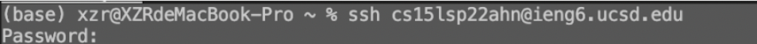

# CSE 15L lab report 1

## Part 1 VScode
> Blockquote Visual studio Code is a powerful code editor for Windows, Linux and macOS operation systems.

1. go to [Visual Studio Code website](https://code.visualstudio.com/)

2. select the version for your operation system. 

3. open downloaded VScode, it should be like this 

## Part 2 Remote connection
> remote connection is usually done by **SSH** (Secure Shell Protocol) between local computer and server.

1. SSH requires `account` and `password` to remotely access to server account. You can find `acoount` and update `password` in [there](https://sdacs.ucsd.edu/~icc/index.php)

2. Opening a terminal, type `ssh` `Youraccount` and then type `Yourpassword`
as below 

3. If successfully accessing to server, you should see  

## Part 3 Linux commands
> linux commands can be convenient to edit files' position, properties, and content without actually seeing/clicking it.

* **Some commands you can put in the terminal**
1. `ls` (lists all files/ directories under current directory)
2. `pwd` (print current directory)
3. `cat` `Yourfilename` (print all the content in Yourfilename) 

## Part 4 Moving file with scp
> scp is a command to copy your `specified local file` to your server account under `specified directory`.
1. `scp` `Yourfilename` `Youraccount:TargetDirectory` and type `Yourpassword`.

2. after `ssh` to `Youraccount`, change to your target directory, and then type `ls`. You should see your specified file copied to there. 

## Part 5 setting SSH key
> Keeping a `public` SSH key on server account while a `private` SSH key on the client saves your time from typing password when `ssh` or `scp` file to access to your server account

1. on client terminal, type `ssh-keygen`. This command generates both `public` and `private` key files on the client