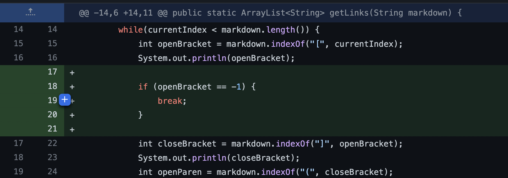
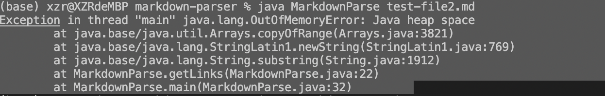
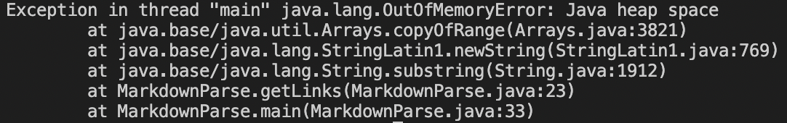

# CSE 15L lab report 2

## __First Code Change__

### 1. Commit history

> We add a conditional branch to `break` loop when `indexOf` method call for `missing open Bracket returns -1`

### 2. Link to failure inducing file
> Our failure inducing input is caused by adding 
```
enjoy :)
``` 
to the end of file

> File link is attached here
[Failure-Inducing input1](test-file2.md)

### 3. Failure-inducing symptoms
> The failure symptom is `Java Heap OutOfMemoryError`.



### 4. Discussion on bug and symptom
> The failure inducing input is `missing open Bracket` at the end of file.

> Our original code didn't consider when `indexOf` method call `returns -1` for not finding `parameter String`, so the missing `open bracket` at the end of file returns `-1` to `indexOf` as starting index to find `close bracket`. `indexOf` method treats `-1` as `0` to search first occurrence index of `close bracket` in the file, then first `open parenthesis` and `close parenthesis`. 

>Along this way, our original code repeatedly `add` the `first` url link in the file to `ArrayList` and `cannot break the while loop`. It causes `Heap OutOfMemory`.


## __Second Code Change__

### 1. Commit history

> We delete the conditional branch only for `missing openBracket` and add a conditional branch to break the loop for `any missing brackets and parentheses` before `adding to Arraylist`.

### 2. Link to failure inducing file
> Our failure inducing input is caused by adding 
```
[enjoy] :)
``` 
to the end of file

> File link is attached here
[Failure-Inducing input3](test-file3.md)

### 3. Failure-inducing symptoms
> The failure symptom is `Java Heap OutOfMemoryError`.



### 4. Reason behind our code change
> The failure inducing input is `missing open parenthsis` at the end of file.

> Our modified code only considers `missing open bracket`, while didn't consider when `indexOf` method call `returns -1` for not finding `open parenthesis`, so the missing `open parenthesis` at the end of file returns `-1` to `indexOf` as starting index to find `close parenthesis`. `indexOf` method treats `-1` as `0` to search first occurrence index of `close parenthesis` in the file. 

>Along this way,`substring method` in our previous code repeatedly `add` either `first` url in the file, or everything before `first` url link's `close parenthesis` in the file to `ArrayList` and `cannot break the while loop`. It causes `Heap OutOfMemory`.


## Third Code Change__

### 1. Commit history

> We add a conditional branch to the code

### 2. Link to failure inducing file
> Our failure inducing input is

> File link is attached here
[Failure-Inducing input](test-file3.md)

### 3. Failure-inducing symptoms
> 


### 4. Reason behind our code change
> 