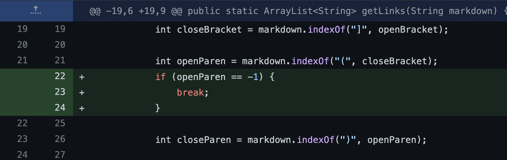
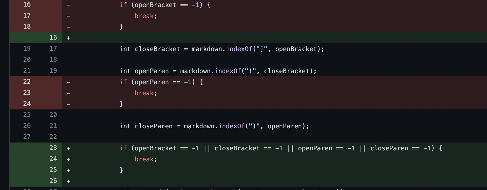
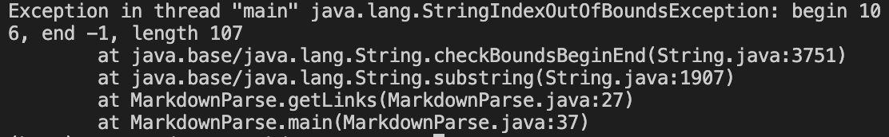

# CSE 15L lab report 2

## __First Code Change__

### 1. Commit history

> We add a conditional branch to `break` loop for `missing open Bracket` before `adding to Arraylist`.

### 2. Link to failure inducing file
> Our failure inducing input is caused by adding 
```
enjoy :)
``` 
to the end of file

> File link is attached here
[Failure-Inducing input](test-file2.md)

### 3. Failure-inducing symptoms
> The failure symptom is `Java Heap OutOfMemoryError`.


### 4. Discussion on bug and symptom
> The failure inducing input is `missing open Bracket` at the end of file.

> Our original code didn't consider when `indexOf` method call `returns -1` for not finding `parameter String`, so the missing `open bracket` at the end of file returns `-1` to `indexOf` as starting index to find `close bracket`. `indexOf` method treats `-1` as `0` to search first occurrence index of `close bracket` in the file, then first `open parenthesis` and `close parenthesis`. 

>Along this way, our original code repeatedly `add` the `first` url link in the file to `ArrayList` and `cannot break the while loop`. It causes `Heap OutOfMemory`.


## __Second Code Change__

### 1. Commit history

> We add a conditional branch to break the loop for `missing open parentheses` before `adding to Arraylist`.

### 2. Link to failure inducing file
> Our failure inducing input is caused by adding 
```
[enjoy] :)
``` 
to the end of file

> File link is attached here
[Failure-Inducing input3](test-file3.md)

### 3. Failure-inducing symptoms
> The failure symptom is `Java Heap OutOfMemoryError`.


### 4. Reason behind our code change
> The failure inducing input is `missing open parenthsis` at the end of file.

> Our modified code only considers `missing open bracket`, while didn't consider when `indexOf` method call `returns -1` for not finding `open parenthesis`, so the missing `open parenthesis` at the end of file returns `-1` to `indexOf` as starting index to find `close parenthesis`. `indexOf` method treats `-1` as `0` to search first occurrence index of `close parenthesis` in the file. 

>Along this way,`substring method` in our previous code repeatedly `add` either `first` url in the file, or everything before `first` url link's `close parenthesis` in the file to `ArrayList` and `cannot break the while loop`. It causes `Heap OutOfMemory`.


## Third Code Change__

### 1. Commit history

> We delete previous conditional branches for `missing open Bracket` and `missing open parenthesis`, and add a general conditional branch to break the loop for `any missing brackets/parentheses` before `adding to Arraylist`

### 2. Link to failure inducing file
> Our failure inducing input is
```
[enjoy] (:
``` 
> File link is attached here
[Failure-Inducing input](test-file4.md)

### 3. Failure-inducing symptoms
> The failure symptom is `String IndexOutOfBounds Error`.




### 4. Reason behind our code change
> The failure inducing input is `missing close parenthsis` at the end of file.

> Our modified code only considers `missing open bracket and parenthsis`, while didn't consider when `indexOf` method call `returns -1` for not finding `close parenthesis`, so the missing `close parenthesis` at the end of file returns `-1`
> `Add url link` to `Arraylist` is based on `substring` method to take `index` of `open parenthesis + 1 and close parenthesis`. However, it is illegal for `substring` method to take `negative number -1` as `ending index parameter`, so it causes `String IndexOutOfBounds Error`
