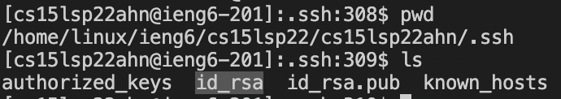
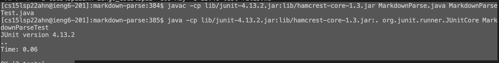

# CSE 15L lab report 3

## Streamlining ssh Configuration

1. First using `command + shift + .` to show hidden `.ssh directory` on Mac system
2. Editing `.ssh/config` by Visual Studio Code with
    ```
    Host ieng6
        HostName ieng6.ucsd.edu
        User cs15lsp22ahn
    ```
    

3. Logging to the `cs15lsp22ahn server account` with alias `ieng6`
    

4. `scp sshStreamlineFile.txt` to the server account with alias `ieng6` 

Successful `scp command`


## Github Access from ieng6

1. Using `gen-key` on `ieng6 server account` to create both public and private ssh key files
> Public key's absolute path on server account is `/home/linux/ieng6/cs15lsp22/cs15lsp22ahn/.ssh/id_rsa.pub`


> Public key is located in Github profile > setting > SSH and GPG keys > add SSH key 


2. Private key's absolute path is also under `.ssh` directory on server account
> `/home/linux/ieng6/cs15lsp22/cs15lsp22ahn/.ssh/id_rsa`



3. Adding two new files `hola.txt` and `vanikkam.txt` into `test repository` on `ieng6 server account` and `commit` changes


4. `Push` commits from `ieng6 server account` to `test repository on GitHub`


5. Link of `commit` history is attached [here](https://github.com/xzrRyan/test/commit/9211ef7c37a15e228a6451e66ebb4e69bbc651b9)

## Copy Whole Directory to GitHub
1. `scp` whole `markdown-parse directory` to server account by `scp -r . ieng6:~/markdown-parse`


2. `markdown-parse directory` now in server account

Compiling `MarkdownParse.java` and `MarkdownPaseTest.java`and running `MarkdownPaseTest`


3. 