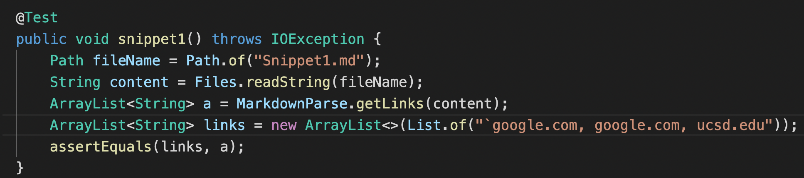
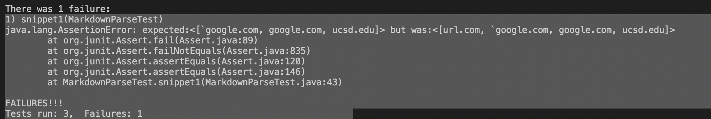
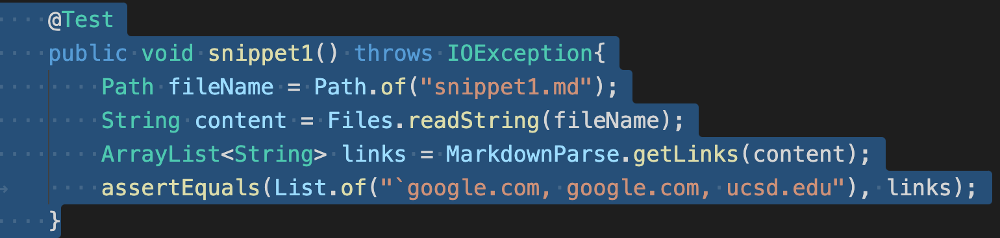
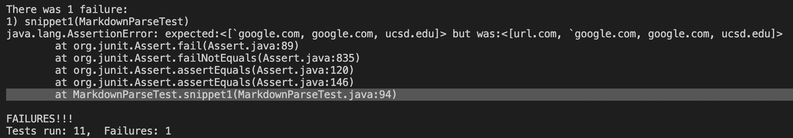
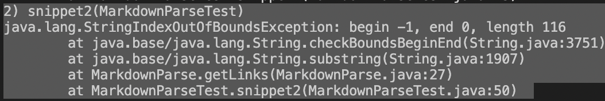
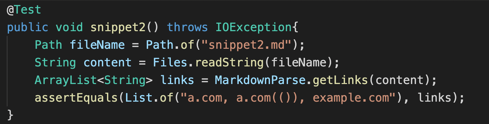
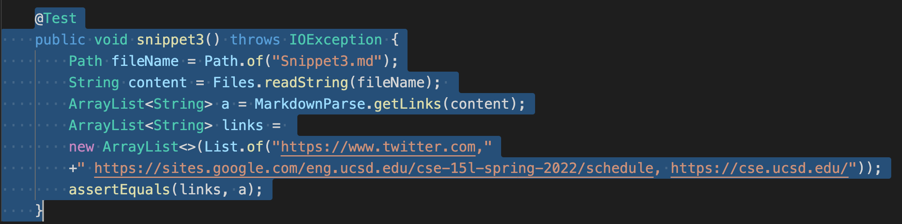
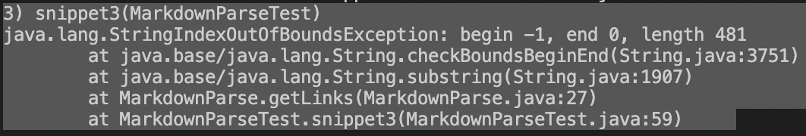
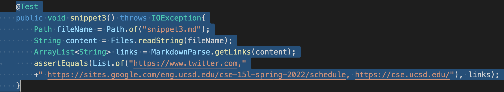
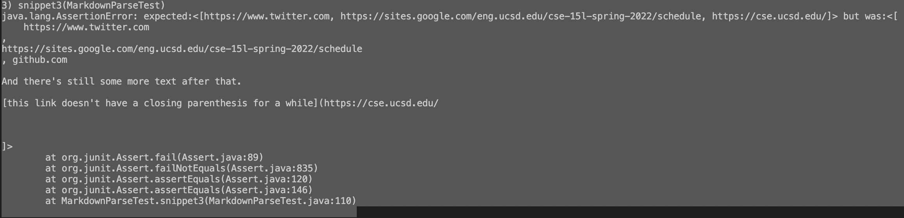

# CSE 15L lab report 4
> [My MarkdownParse Repo](https://github.com/xzrRyan/markdown-parser)

> [Review MarkdownParse Repo](https://github.com/cmy0357/markdown-parser)

## Code tmplementation/testing for Snippets
### Snippet 1
* To test following code as Snippet 1, I put them into markdown file to run test
    ```
    `[a link`](url.com)

    [another link](`google.com)`

    [`cod[e`](google.com)

    [`code]`](ucsd.edu)
    ```
* Expected output based on Visual Studio Code preview is 
``[`google.com, google.com, ucsd.edu]``

* Adding Test `snippet1` to my `MarkdownParseTester` 

The Junit output fails on `snippet1` for `assertEquals` between `expected output` and `actual output`


* Adding Test `snippet1` to review `MarkdownParseTester` 

The Junit output fails on `snippet1` for `assertEquals` between `expected output` and `actual output`


* My code revision
    > There is a way to modify MarkdownParse for inline backtick within 10 lines.

    > My current conditional branch on line 27 for checking backtick relying on both backtick before openBracket and closeParen.

    > I can modify this branch using `substring`, `equals`, and `contains` methods, and use `(equals to check for one backtick in the rest of substring` `&&` `substring contains another backtick before closeBracket)` `||`
    use `(equals to check for backtick after closeBracket but before openParen)`. Because only when `first backtick` is before Bracket with `another backtick` at any place after it, and when one `backtick` appears between `closeBracket` and `openParen`, backticks disrupt website links

### Snippet 2

* To test following code as Snippet 2, I put them into markdown test-file
    ```
    [a [nested link](a.com)](b.com)

    [a nested parenthesized url](a.com(()))

    [some escaped \[ brackets \]](example.com)

    ```
* Expected output based on Visual Studio Code preview is 
`[a.com, a.com(()), example.com]`

* Adding Test `snippet2` to my `MarkdownParseTester` 

The Junit output fails on `snippet2 with getLinks() throwing IndexOutOfBounds exception`


* Adding Test `snippet2` to review `MarkdownParseTester` 

The Junit output fails on `snippet2` for `assertEquals` between `expected output` and `actual output`


* My code revision
    > I need more than 10 lines to modify MarkdownParse for nested Brackets, Parenthese, and escaped Brackets.

    > The error exception is thrown by my conditional branch to check `backticks`, and I can modify the conditional branch by using `indexOf` method for `backticks` one after another, and compare backticks' indices with open/close Bracket/Parentheses so to avoid `substring(-1, 0)` for `no backtick `before `first openBracket` in Markdown file.

    > Nested Brackets, escaped Brackets, and Parenthese inside `Brackets/Parenthese` will not affect website link search. Catching `closeBracket` is still enough to find nearest `openParen/closeParen` pairs. However, `nested Brackes and Parenthese inside Parenthese` will affect website link search. For example, `[name](((websitelink)[[\]]))`, expected website link is between the `first openParen` and `last closeParen`, but it needs a complex conditional branche more than 10 lines to catch the `expected last openParen`, since the nested openBracket prevent searching based on `next closest openBracket`.

### Snippet 3

* To test following code as Snippet 3, I put them into markdown test-file
    ```
    [this title text is really long and takes up more than 
    one line

    and has some line breaks](
    https://www.twitter.com
    )

    [this title text is really long and takes up more than 
    one line](
    https://sites.google.com/eng.ucsd.edu/cse-15l-spring-2022/schedule
    )


    [this link doesn't have a closing parenthesis](github.com

    And there's still some more text after that.

    [this link doesn't have a closing parenthesis for a while](https://cse.ucsd.edu/


    )

    And then there's more text

    ```

* Expected output based on Visual Studio Code preview is 
`[https://www.twitter.com, https://sites.google.com/eng.ucsd.edu/cse-15l-spring-2022/schedule, https://cse.ucsd.edu/]`

* Adding Test `snippet3` to my `MarkdownParseTester` 

The Junit output fails on `snippet3 with getLinks() throwing IndexOutOfBounds exception`


* Adding Test `snippet3` to review `MarkdownParseTester` 

The Junit output fails on `snippet3` for `assertEquals` between `expected output` and `actual output`

    
* My code revision
    > There is a way to modify MarkdownParse that has new lines for `brackets and parenthese` within 10 lines.

    > Following the same procedure as mentioned in Snippet2, I can fix substring(-1, 0) error with indexOf method.

    > I can modify `substring for expected website link` with `trim()` method to cut off all spaces between the parenthese. Also, I need to add a conditional branch to check if there is a `closeParen` after `openParen` on different lines, but only with spaces in between. If not so, the content in between shouldn't be caught, since Markdown language doesn't pair up the openParen and nearestClose on different lines in that situation as website link.