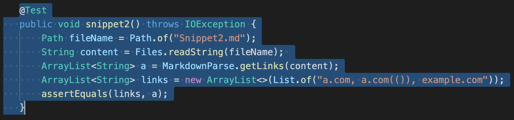
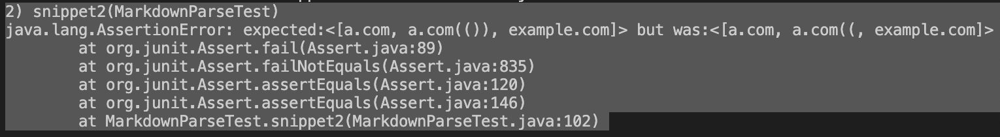

# CSE 15L lab report 4
> [My MarkdownParse Repo]()

> [Review MarkdownParse Repo]()

## Code tmplementation/testing for Snippets
### Snippet 1
* To test following code as Snippet 1, I put them into markdown file to run test
    ```
    `[a link`](url.com)

    [another link](`google.com)`

    [`cod[e`](google.com)

    [`code]`](ucsd.edu)
    ```
* Expected output based on Visual Studio Code preview is 
``[`google.com, google.com, ucsd.edu]``

* Adding Test `snippet1` to my `MarkdownParseTester` 

The Junit output fails on `snippet1`


* Adding Test `snippet1` to review `MarkdownParseTester` 

The Junit output fails on `snippet1`


* My code revision

### Snippet 2

* To test following code as Snippet 2, I put them into markdown test-file
    ```
    [a [nested link](a.com)](b.com)

    [a nested parenthesized url](a.com(()))

    [some escaped \[ brackets \]](example.com)

    ```
* Expected output based on Visual Studio Code preview is 
`[a.com, a.com(()), example.com]`

* Adding Test `snippet2` to my `MarkdownParseTester` 

The Junit output fails on `snippet2 with IndexOutOfBounds exception`


* Adding Test `snippet2` to review `MarkdownParseTester` 

The Junit output fails on `snippet2`


* My code revision

### Snippet 3

* To test following code as Snippet 3, I put them into markdown test-file
    ```
    [this title text is really long and takes up more than 
    one line

    and has some line breaks](
    https://www.twitter.com
    )

    [this title text is really long and takes up more than 
    one line](
    https://sites.google.com/eng.ucsd.edu/cse-15l-spring-2022/schedule
    )


    [this link doesn't have a closing parenthesis](github.com

    And there's still some more text after that.

    [this link doesn't have a closing parenthesis for a while](https://cse.ucsd.edu/

    ```

* Expected output based on Visual Studio Code preview is 
`[https://www.twitter.com, https://sites.google.com/eng.ucsd.edu/cse-15l-spring-2022/schedule, https://cse.ucsd.edu/]`

* Adding Test `snippet3` to my `MarkdownParseTester` 

The Junit output fails on `snippet3 with IndexOutOfBounds exception`


* Adding Test `snippet3` to review `MarkdownParseTester` 

The Junit output fails on `snippet2`

    
* My code revision
