# CSE 15L lab report 5

## Compiling and running MarkdownParse
> Compiling both my version and lab 9 version `MarkdownParse.java` on `ieng6 account` through `make test` rule in command lines.
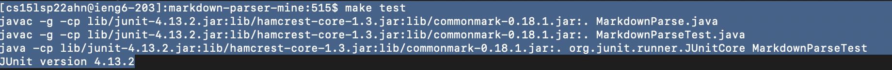
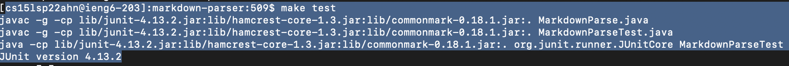
Then `running` MarkdownParse with `test-files` through `bash script.sh` and direct all `running outputs` into `result.txt`
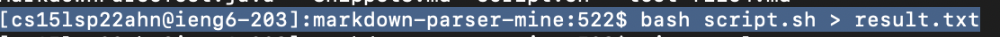
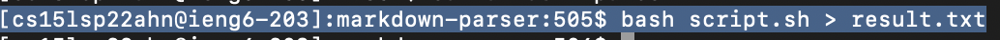

## Difference in running results
> Using `vimdiff` to compare my version `result.txt` with lab 9 version `result.txt`

> The `colored line` in the picture below refers to some `difference` in `testing outputs`. Left window is for `my version`, and right window is for `lab 9 version` of `outputs`
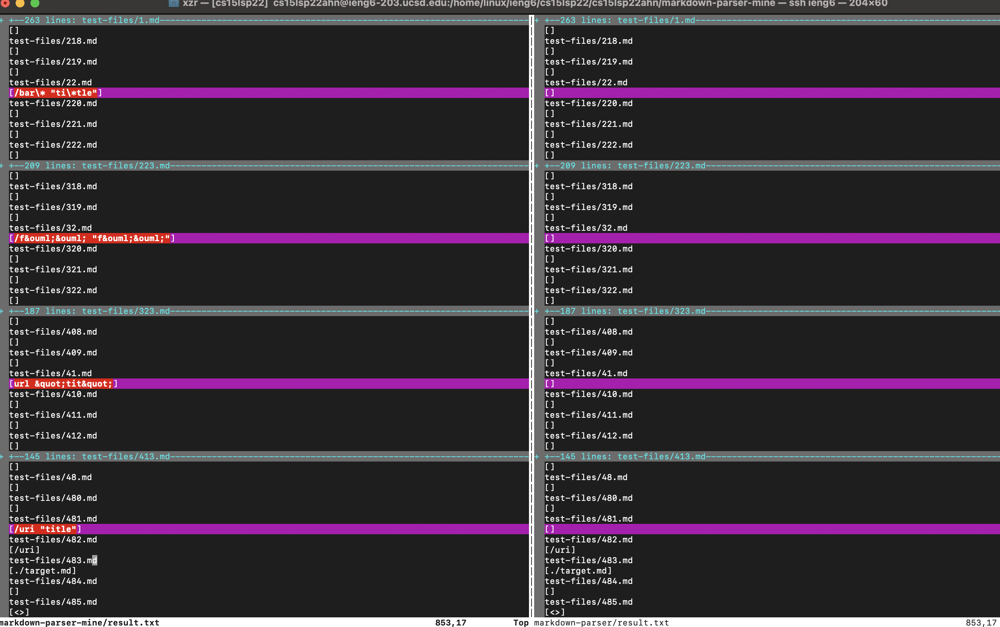

## Difference markdown testing files
> As the last picture shows, the `name` of each `testing markdown file` is listed just one line above each `output` in two `windows`

> Among all different testing results, [22.md](https://github.com/xzrRyan/markdown-parser/blob/main/test-files/22.md) and [567.md](https://github.com/xzrRyan/markdown-parser/blob/main/test-files/567.md) are chosen for analyzing different bugs.

## Analysis of testing file 22.md

### Actual and expected output
> `lab 9 version` of MarkdownParse gives out `correct` output

> `Actual output` for `my version` of MarkdownParse is shown below in the picture

    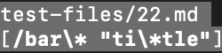

> `Actual output` for `lab 9 version` of MarkdownParse is shown below in the picture

    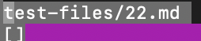

> `Expected output` for testing file `22.md` is analyzed in `VScode preview mode`

    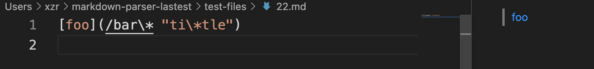
    
> Though `/bar\* "ti\*tle"` is shown as a complete `link` in markdown language, but the content inside parenthese `cannot be a valid website link`, so it is `not` the content we expect MarkdownParse to grab.
> In this case, only `lab 9` version of MarkdownParse returns an `empty` output consistent with `expected` output

### Analysis of bug in my version
> `"` and `*` are `not` expected as part of `valid` website link, so MarkdownParse should check the existence of  `"` and `*` inside `brackets`. However, my version of MarkdownParse only checks if there are `"` before `open parenthesis` and after `close bracket`.

> To better capture `"` and `*` inside `brackets`, I should first add `Or` condition `||(checking existence of " inside brackets)` to the `line 27`. 
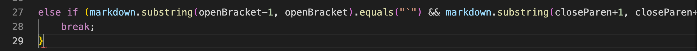
Then, I should add a new `conditional branch` between the code on `line 27` and `line 30` to check `existence of * inside brackets`
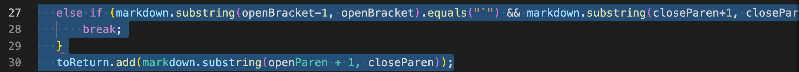


## Analysis of testing file 567.md

### Actual and expected output
> `lab 9 version` of MarkdownParse gives out `correct` output

> `Actual output` for `my version` of MarkdownParse is shown below in the picture
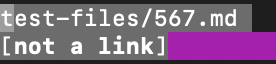

> `Actual output` for `lab 9 version` of MarkdownParse is shown below in the picture
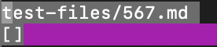

> `Expected output` for testing file `567.md` is analyzed in `VScode preview mode`
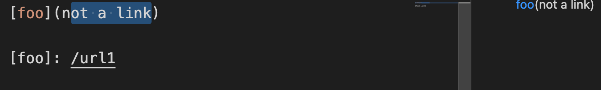
```
[foo](not a link)

[foo]: /url1
```
> Though `foo` in the first line in `567.md` is `highlighted blue` as a `link` in markdown language, the content inside parenthese `cannot be a valid website link`, so it is `not` the content we expect MarkdownParse to grab.
> In this case, only `lab 9` version of MarkdownParse returns an `empty` output consistent with `expected` output

### Analysis of bug in my version
> `space` is not expected as part of `valid` website link, so MarkdownParse should check the existence of  `space` between `String` inside `brackets`. However, my version of MarkdownParse only checks the existence of `parenthese/brackets`. Though it successfully rule out `[foo]: /url1` based on `missing parentheses`, my version wrongly grabs `[foo](not a link)`.

> To better capture `space` inside `brackets`, I should first add `conditional branch` based on `trim` between the code on `line 27` and `line 30` 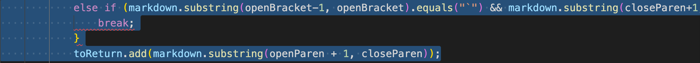
to check if some `space` still exists inside `brackets` after `trim()`, since trim() only trims only trims off `valid space` at the `beginning` or the `end` of `brackets content`, the existence of `space` must be in `middle` of `String` in `brackets`.